# AtivaMente

Aplicativo de acompanhamento terapêutico infantil para uma clínica de terapias
(fonoaudiologia, psicologia, terapia ocupacional e fisioterapia).

O problema que ele resolve: hoje o pai ou a mãe de uma criança em terapia
descobre como foi a sessão por WhatsApp, por bilhete ou perguntando na recepção.
As evoluções clínicas ficam no papel, a agenda fica na cabeça da coordenação, e
não existe um lugar único onde a família acompanhe o desenvolvimento do filho.

O AtivaMente centraliza isso em dois produtos que conversam entre si.

---

## As telas

### O app dos responsáveis

<table>
  <tr>
    <td align="center"><br><sub><b>Onboarding</b></sub></td>
    <td align="center">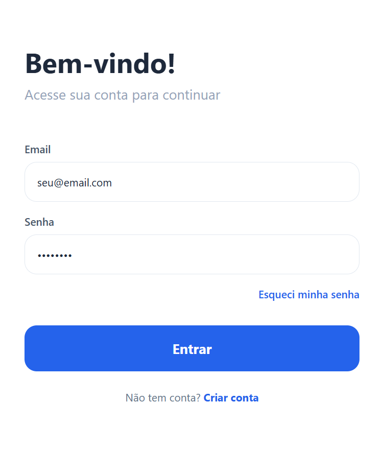<br><sub><b>Login</b></sub></td>
    <td align="center">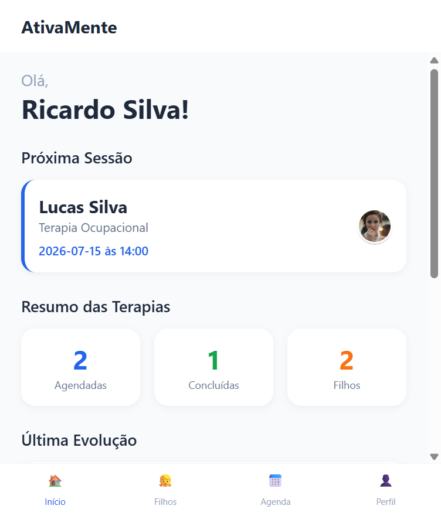<br><sub><b>Início</b></sub></td>
    <td align="center">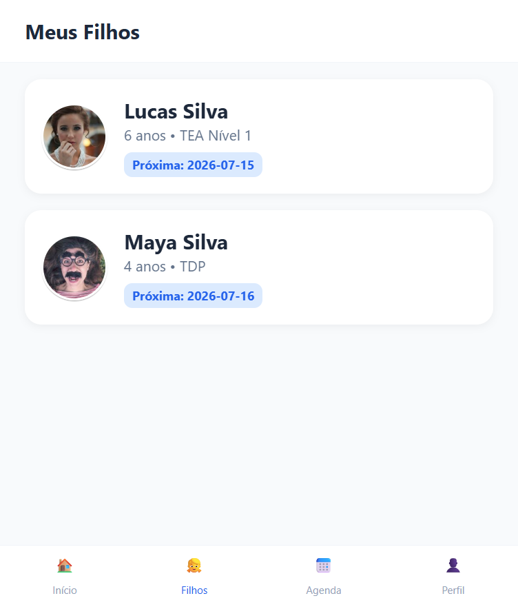<br><sub><b>Meus filhos</b></sub></td>
  </tr>
  <tr>
    <td align="center">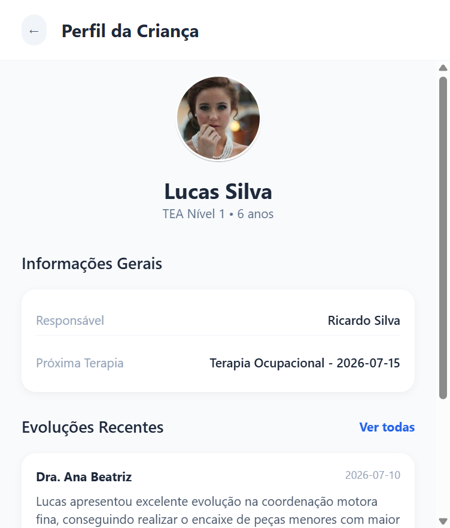<br><sub><b>Perfil da criança</b></sub></td>
    <td align="center">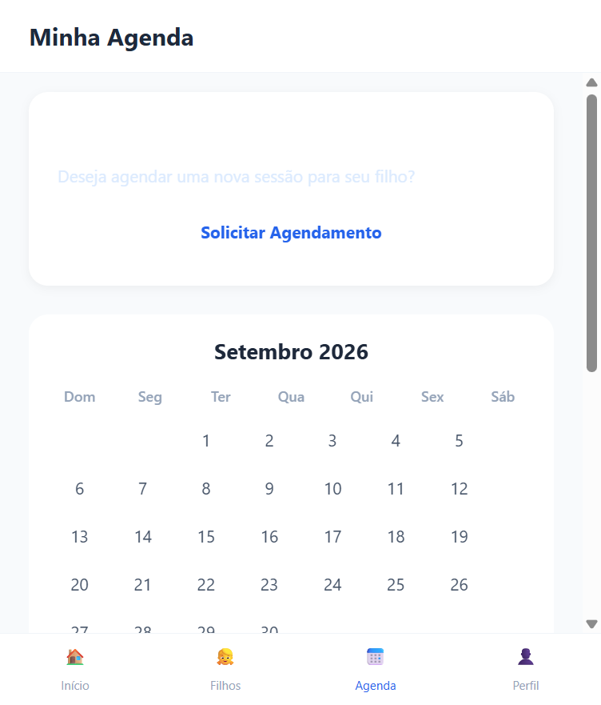<br><sub><b>Agenda</b></sub></td>
    <td align="center">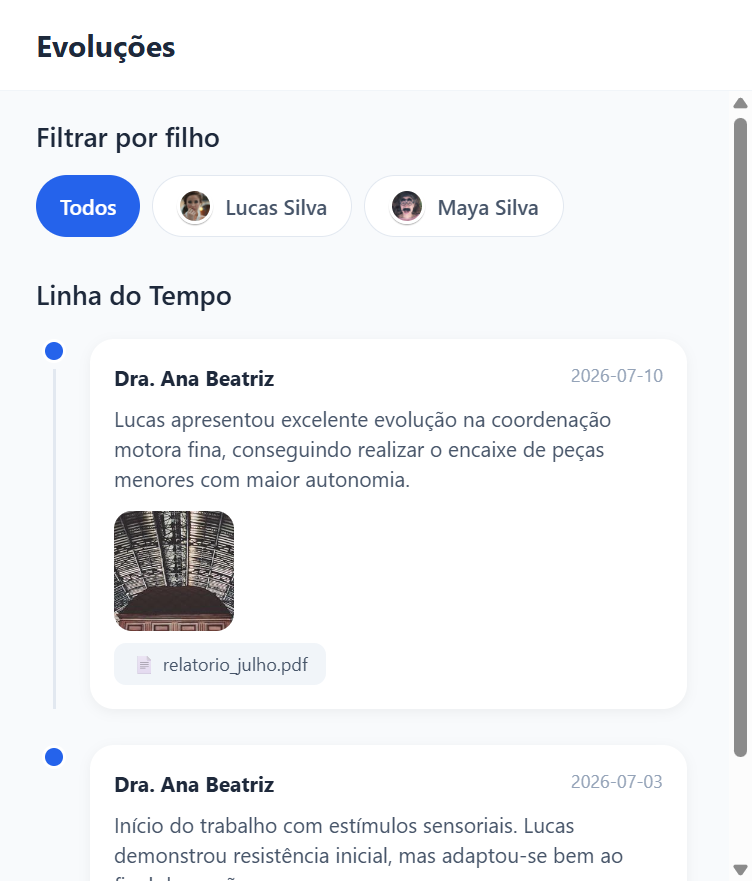<br><sub><b>Evoluções</b></sub></td>
    <td align="center"><br><sub><b>Perfil</b></sub></td>
  </tr>
</table>

<sub>Capturas do app rodando de verdade, em viewport de 390&times;844 (tamanho de
celular). Foram feitas pela versão web (`npm run web`), que executa o mesmo
código React Native através do react-native-web — por isso aparece a barra de
rolagem do navegador em algumas telas.</sub>

### O painel da clínica

<table>
  <tr>
    <td align="center">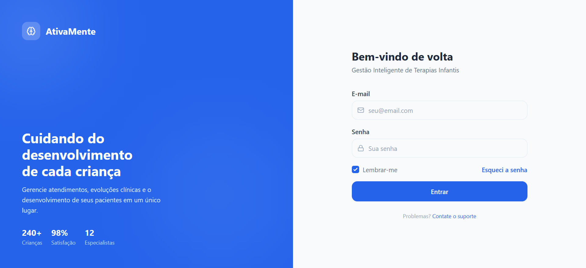<br><sub><b>Login</b></sub></td>
    <td align="center">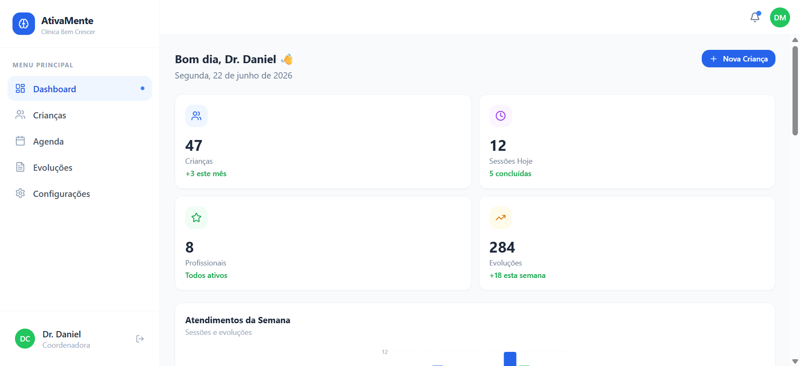<br><sub><b>Dashboard</b></sub></td>
  </tr>
  <tr>
    <td align="center">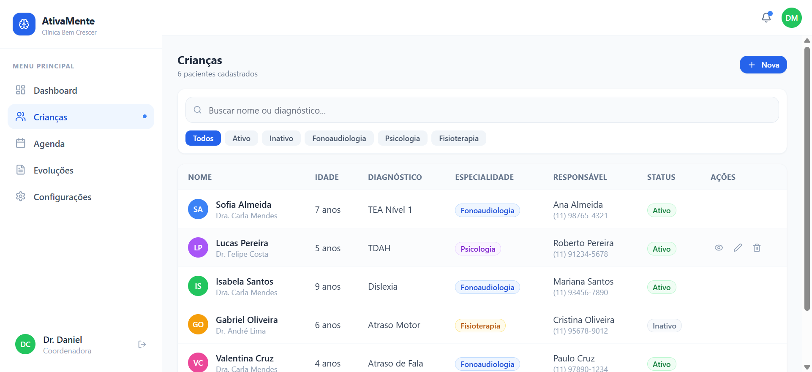<br><sub><b>Crianças</b></sub></td>
    <td align="center">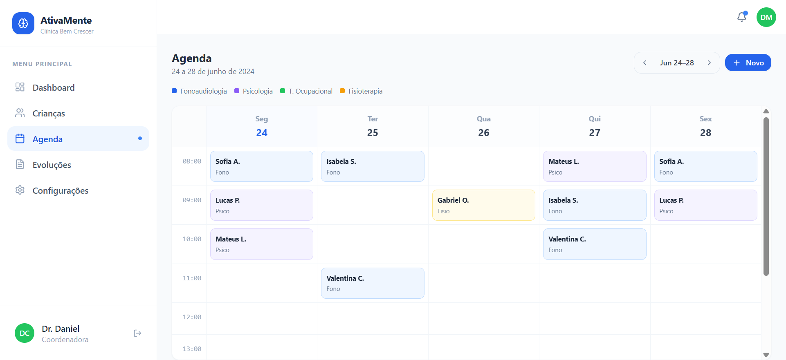<br><sub><b>Agenda</b></sub></td>
  </tr>
  <tr>
    <td align="center">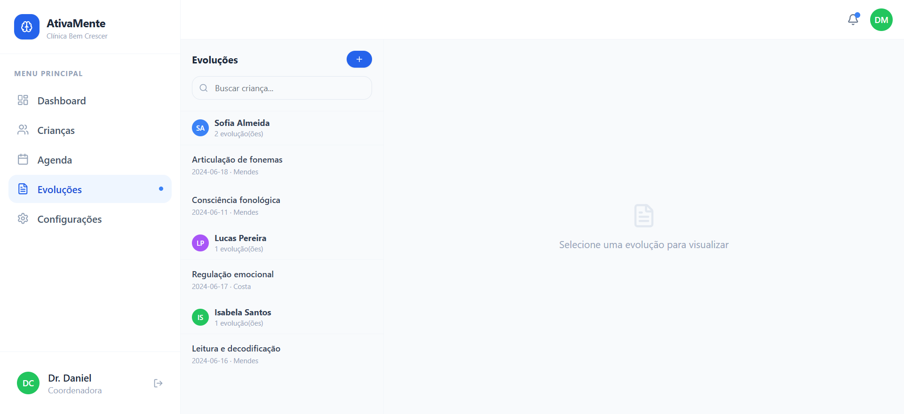<br><sub><b>Evoluções</b></sub></td>
    <td align="center">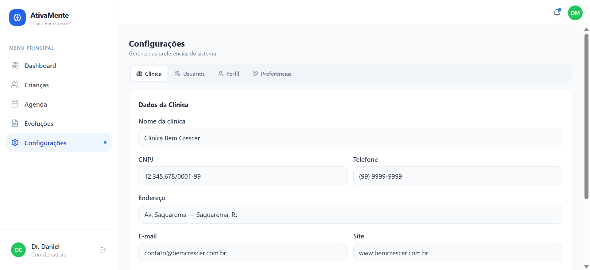<br><sub><b>Configurações</b></sub></td>
  </tr>
</table>

<sub>Capturas dos componentes Vue deste repositório rodando em viewport de
1280&times;800, e não do protótipo do Figma. Como o Inertia precisa de um
backend, as páginas foram montadas por um harness que fornece o atributo
<code>data-page</code> diretamente — o suficiente para renderizar cada tela com
os dados de demonstração.</sub>

---

## As duas partes

### 1. App dos responsáveis (React Native / Expo)

O aplicativo de celular que o pai ou a mãe usa. Permite ver a agenda das
sessões, solicitar novos agendamentos, acompanhar a linha do tempo de evoluções
escritas pelos terapeutas e gerenciar o perfil.

São 12 telas: splash, onboarding, login, cadastro, recuperação de senha, início,
lista de filhos, perfil da criança, agenda, evoluções, notificações e perfil.

### 2. Painel da clínica (Vue 3 + Inertia.js)

A área administrativa que a coordenação e os terapeutas usam no navegador.
Dashboard com indicadores e gráficos, cadastro e prontuário de pacientes, grade
semanal de horários, registro de evoluções clínicas e configurações da clínica
e da equipe.

São 8 telas, portadas de um protótipo feito no Figma Make.

### Uma observação sobre a pasta `resources/`

O app dos responsáveis também foi portado para a web (Vue 3 + Inertia), para
que as duas partes compartilhem a mesma base de código no navegador. Por isso
`resources/js/Pages/` tem 20 páginas: 12 são a versão web do app dos
responsáveis e 8 são o painel da clínica, sob `Pages/Admin/`.

Quem for avaliar o app dos responsáveis deve olhar a versão React Native em
`src/` — é ela que roda com `npm start`.

---

## Estado atual: protótipo de interface

**Importante para avaliar o que está aqui.** Este repositório é o MVP de
*frontend*. As telas estão construídas, navegáveis e com os estados de
interface funcionando (filtros, abas, modais, formulários com validação), mas:

- **não há backend nem banco de dados** — os dados vêm de arquivos de
  demonstração (`src/services/mockData.ts` e
  `resources/js/services/adminMockData.js`);
- **não há autenticação real** — as telas de login existem e validam os campos,
  mas não autenticam contra servidor nenhum;
- ações como excluir um paciente ou confirmar um agendamento ainda não
  persistem nada.

Isso é deliberado: a camada de dados foi desenhada para ser substituída sem
reescrever as telas. Cada página recebe seus dados como propriedades e só cai
nos dados de demonstração quando o servidor ainda não os envia.

---

## Como rodar

Você precisa de **Node.js 18 ou superior**.

```bash
npm install
npm start
```

O Expo abre um menu no terminal com um QR Code:

- **no celular** — instale o app *Expo Go* ([Android](https://play.google.com/store/apps/details?id=host.exp.exponent) /
  [iOS](https://apps.apple.com/app/expo-go/id982107779)) e aponte a câmera para o QR Code;
- **no navegador** — tecle `w` no terminal (ou rode `npm run web`);
- **em emulador** — tecle `a` para Android ou `i` para iOS.

A forma mais rápida de ver o app rodando é pelo navegador com `npm run web`.

O app abre na splash screen, segue para o onboarding e depois para o login.
**Qualquer e-mail válido e qualquer senha com 6 ou mais caracteres entram** — a
autenticação é simulada.

### E o painel da clínica?

O painel é uma aplicação web feita com **Inertia.js**, que não é um roteador de
cliente: ele é a ponte entre um backend que renderiza as respostas (Laravel) e
um frontend Vue. Por isso o código dele está aqui em `resources/`, mas **não
roda sozinho neste repositório** — precisa ser instalado dentro de um projeto
Laravel.

O arquivo [VUE-INERTIA.md](VUE-INERTIA.md) explica o porte em detalhe, e
`routes/web.php` traz as rotas de exemplo do lado do servidor.

---

## Stack

| Parte | Tecnologias |
| --- | --- |
| App dos responsáveis | React Native 0.74, Expo 51, expo-router 3.5, TypeScript |
| Estilização (app) | NativeWind (Tailwind CSS para React Native) |
| Estado e formulários | Zustand, React Hook Form, Zod |
| Painel da clínica | Vue 3 (Composition API), Inertia.js, Tailwind CSS |
| Build do painel | Vite |

Os gráficos do dashboard foram escritos à mão em SVG, sem biblioteca de
gráficos.

---

## Mapa do repositório

```text
app/                      rotas do app (expo-router) — cada arquivo só
                          re-exporta a tela correspondente de src/screens
├── _layout.tsx           pilha de navegação
├── (tabs)/_layout.tsx    barra de abas inferior
└── ...

src/                      o código do app dos responsáveis
├── screens/              as 12 telas
├── components/ui/        botões, card, input, modal, calendário, timeline...
├── services/
│   ├── mockData.ts       DADOS DE DEMONSTRAÇÃO — troque por chamadas reais
│   └── api.ts            camada de serviço (hoje devolve promessas simuladas)
├── store/authStore.ts    estado de autenticação (Zustand)
├── constants/theme.ts    paleta de cores
└── types/index.ts        tipos do domínio (User, Child, Session, Evolution)

resources/                versão web em Vue 3 + Inertia
├── js/Pages/             12 páginas do app dos responsáveis...
├── js/Pages/Admin/       ...e as 8 telas do painel da clínica
├── js/Components/ui/     componentes da versão web do app
├── js/Components/admin/  componentes do painel + gráficos SVG
├── js/Layouts/           sidebar, header e navegação
└── css/app.css           tema

routes/web.php            rotas de exemplo do backend Laravel
```

---

## Por onde começar a ler

Se a ideia é avaliar o código, esta é a ordem que faz mais sentido:

1. **[`src/types/index.ts`](src/types/index.ts)** — o modelo de domínio em 45
   linhas. Entendendo `User`, `Child`, `Session` e `Evolution`, o resto do
   projeto se explica.
2. **[`src/services/mockData.ts`](src/services/mockData.ts)** — os dados que
   alimentam as telas. Mostra na prática como o domínio se preenche.
3. **[`src/screens/HomeScreen.tsx`](src/screens/HomeScreen.tsx)** — a tela
   inicial do app. Dá para ver o padrão usado em todas as outras: composição de
   componentes de `components/ui/` e estilização por classes do NativeWind.
4. **[`src/components/ui/`](src/components/ui/)** — os componentes reutilizáveis.
   `Calendar.tsx` e `Timeline.tsx` são os mais substanciais.
5. **[`resources/js/Pages/Admin/Dashboard.vue`](resources/js/Pages/Admin/Dashboard.vue)**
   — a tela mais densa do painel, com os gráficos.

---

## Contexto adicional

O painel administrativo nasceu como protótipo no Figma Make (React + Tailwind) e
foi portado para Vue 3 + Inertia seguindo as convenções de um ERP em Laravel
desenvolvido em equipe, onde ele está sendo integrado. O histórico de commits
deste repositório registra esse processo.

## Licença

MIT — veja [LICENSE](LICENSE).
